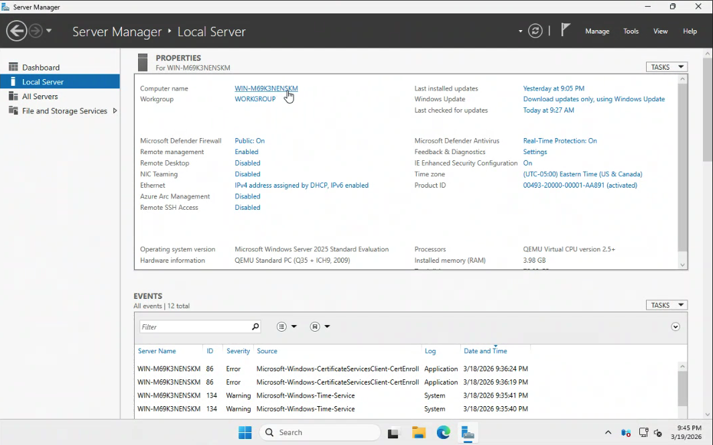
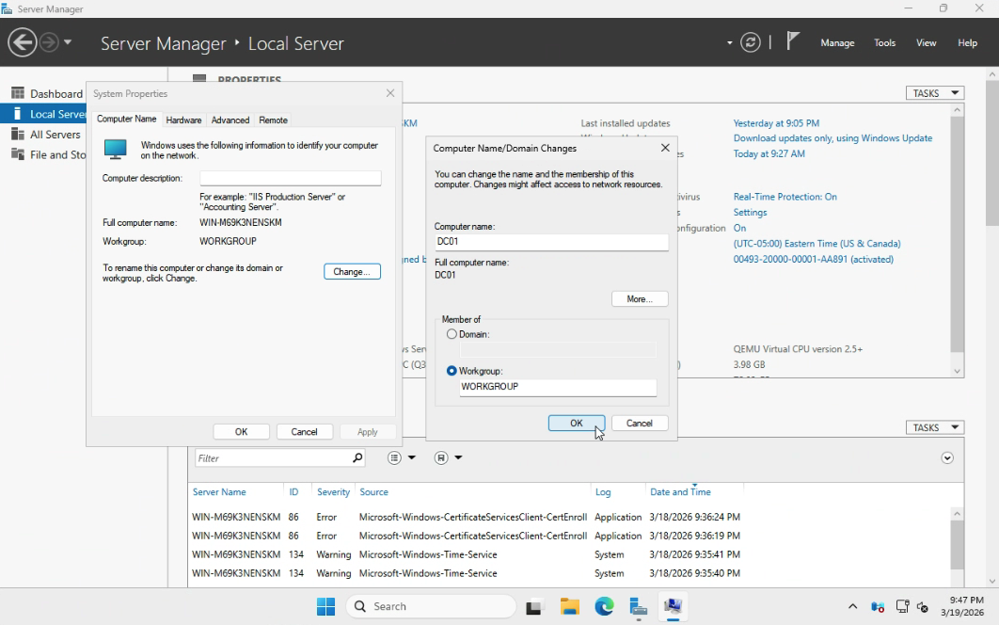
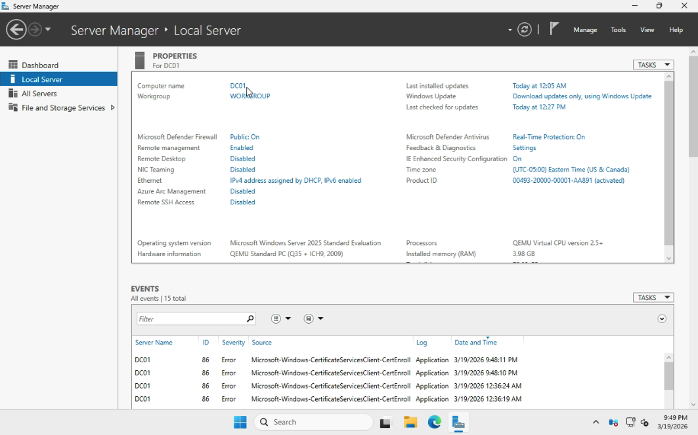
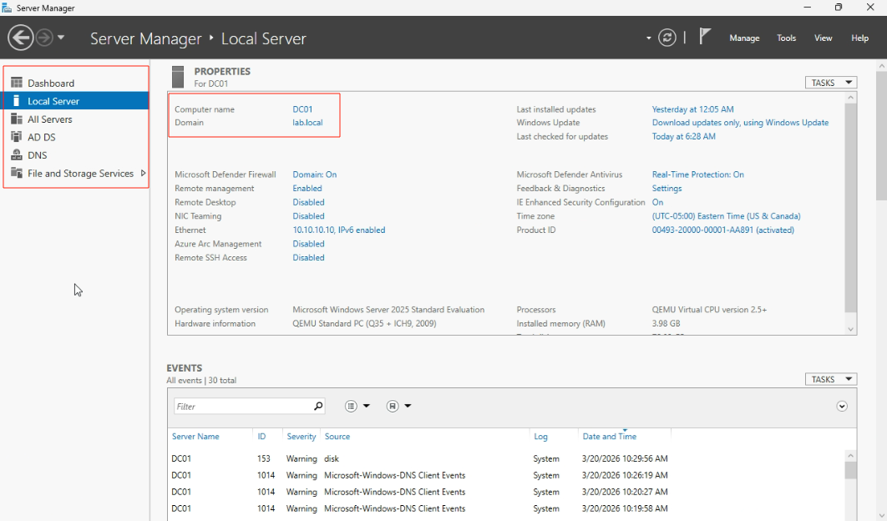

# Lab 01 - Install Active Directory Domain Services

## Table of Contents
- [Overview](#overview)
- [Scenario](#scenario)
- [Objectives](#objectives)
- [Tools and Services Used](#tools-and-services-used)
- [Administrative Workflow](#administrative-workflow)
- [Expected Outcome](#expected-outcome)
- [Common Issues and Troubleshooting](#common-issues-and-troubleshooting)
- [What I Learned](#what-i-learned)

## Overview
This lab documents the initial deployment of Active Directory Domain Services (AD DS) in a Windows Server environment.

The purpose of this project is to demonstrate the core administrative workflow required to prepare a Windows Server virtual machine, configure its network settings, install AD DS, and promote it to a Domain Controller.

## Scenario
A small business is setting up its first internal Windows domain environment to centralize authentication, user management, and administrative control.

As the IT administrator, I need to configure a Windows Server system as the first Domain Controller for the organization.

## Objectives
- Rename the Windows Server virtual machine to a meaningful server name
- Configure a static IP address
- Install the Active Directory Domain Services role
- Promote the server to a Domain Controller
- Create a new Active Directory forest

## Tools and Services Used
- Proxmox VE
- Windows Server 2025
- Active Directory Domain Services (AD DS)
- DNS
- Server Manager

## Administrative Workflow

### Step 1: Rename the Server
- Open **Server Manager**
- Go to **Local Server**
- Select the current **Computer name**
- Click **Change**
- Rename the server to **DC01**
- Restart the server when prompted

### Step 2: Configure a Static IP Address
- In **Server Manager**, go to **Local Server**
- Select **Ethernet**
- Right-click **Eternet** in **Network Connections** and select **Properties**
- Select **IPv4** and click on **Properties**
- Configure the following static network settings:
  - IP address: **10.10.10.10**
  - Subnet mask: **255.255.255.0**
  - Default gateway: **10.10.10.1**
  - Preferred DNS server: **10.10.10.10**

A Domain Controller should use a static IP address to ensure reliable DNS registration and domain communication.

### Step 3: Install the AD DS Role
- In **Server Manager**, select **Manage** > **Add Roles and Features**
- Choose **Role-based or feature-based installation**
- Select the local server
- Check **Active Directory Domain Services**
- Add the required features when prompted
- Continue through the wizard and install the role

This step installs the Windows Server role required for Active Directory.

### Step 4: Promote the Server to a Domain Controller
- After the AD DS role installation finishes, select the notification flag in **Server Manager**
- Click **Promote this server to a domain controller**
- Choose **Add a new forest**
- Enter the root domain name: **lab.local**
- Configure the Directory Services Restore Mode (DSRM) password
- Continue through the wizard and complete the installation

This step creates the first Domain Controller and establishes the Active Directory forest.

### Step 5: Restart and Verify the Configuration
- Allow the server to restart automatically after promotion
- Sign in using the domain administrator account
- Open **Server Manager**
- Confirm that the server is joined to the **lab.local** domain
- Verify that **AD DS** and **DNS** are now installed and visible in Server Manager

This step confirms that the server promotion process completed successfully and that the server is now operating as a Domain Controller.

## Expected Outcome
At the end of this lab:
- The Windows Server VM is renamed to **DC01**
- A static IP address is configured
- The Active Directory Domain Services role is installed
- The server is promoted to a Domain Controller
- A new Active Directory forest named **lab.local** is created
- The environment is ready for domain user and client management

## Common Issues and Troubleshooting

### Issue 1: Server cannot be promoted to a Domain Controller
Possible causes:
- Static IP address is not configured
- DNS settings are incorrect
- The AD DS role installation did not complete successfully

### Issue 2: Domain configuration validation fails
Possible causes:
- Invalid domain name choice
- Incorrect network configuration
- DNS-related issues

## What I Learned
I learned how server naming, static IP configuration, AD DS installation, DNS, and Domain Controller promotion work together as part of building a Windows domain environment. This lab also strengthened my understanding of the preparation steps required before managing users, client devices, and Group Policy in Active Directory.
