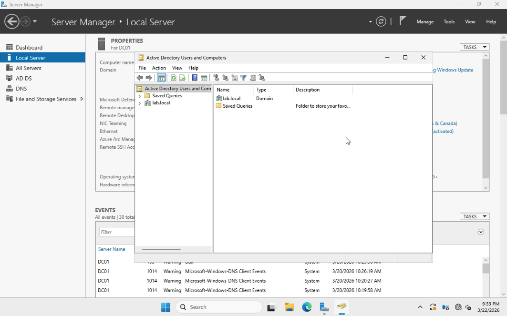
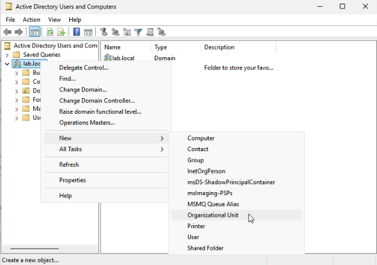
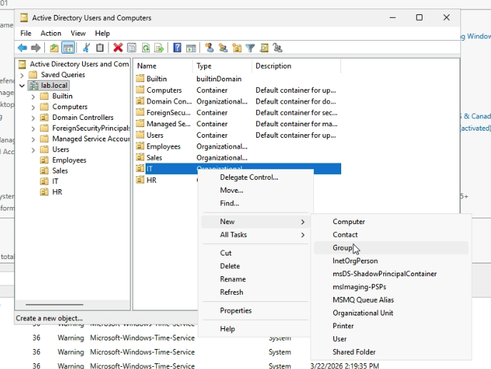
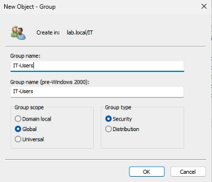

# Lab 02 - Create Users, Groups, and OUs

## Table of Contents
- [Overview](#overview)
- [Scenario](#scenario)
- [Objectives](#objectives)
- [Tools and Services Used](#tools-and-services-used)
- [Administrative Workflow](#administrative-workflow)
- [Expected Outcome](#expected-outcome)
- [Common Issues and Troubleshooting](#common-issues-and-troubleshooting)
- [What I Learned](#what-i-learned)

## Overview
This lab documents the process of creating Organizational Units (OUs), groups, and user accounts in Active Directory.

The purpose of this project is to demonstrate the core administrative workflow required to organize a domain environment and manage user identities in a structured way.

## Scenario
A small business has completed the initial deployment of Active Directory and now needs to organize its domain environment for daily user administration.

As the IT administrator, I need to create Organizational Units for different departments, create groups, and add user accounts in a way that reflects a practical business environment.

## Objectives
- Create Organizational Units (OUs) for administrative organization
- Create groups for access management
- Create domain user accounts
- Assign users to the appropriate groups

## Tools and Services Used
- Proxmox VE
- Windows Server 2025
- Active Directory Users and Computers
- Active Directory Domain Services (AD DS)
- Server Manager

## Administrative Workflow

### Step 1: Open Active Directory Users and Computers
- Open **Server Manager**
- Select **Tools**
- Click **Active Directory Users and Computers**

This tool is used to manage domain objects such as users, groups, computers, and Organizational Units.

### Step 2: Create Organizational Units
- In **Active Directory Users and Computers**, expand the domain
- Right-click the domain name
- Select **New** > **Organizational Unit**
- Create OUs such as:
  - **Employees**
  - **Sales**
  - **IT**
  - **HR**
 
This step helps organize domain objects in a structured and manageable way based on department.

### Step 3: Create Security Groups
- Right-click the appropriate OU
- Select **New** > **Group**
- Create security groups such as:
  - **Sales-Users**
  - **IT-Users**
  - **HR-Users**
- Keep the group type as **Security**

This step helps prepare the environment for access control and permission assignment.

