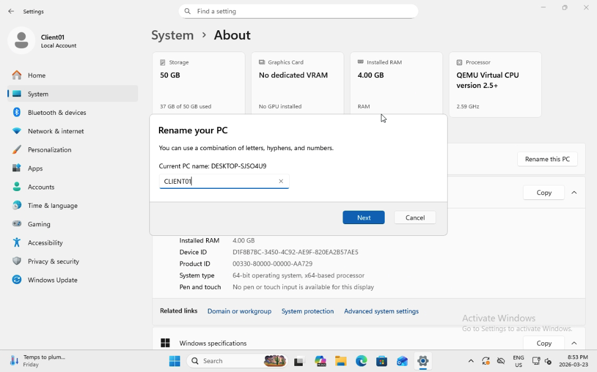
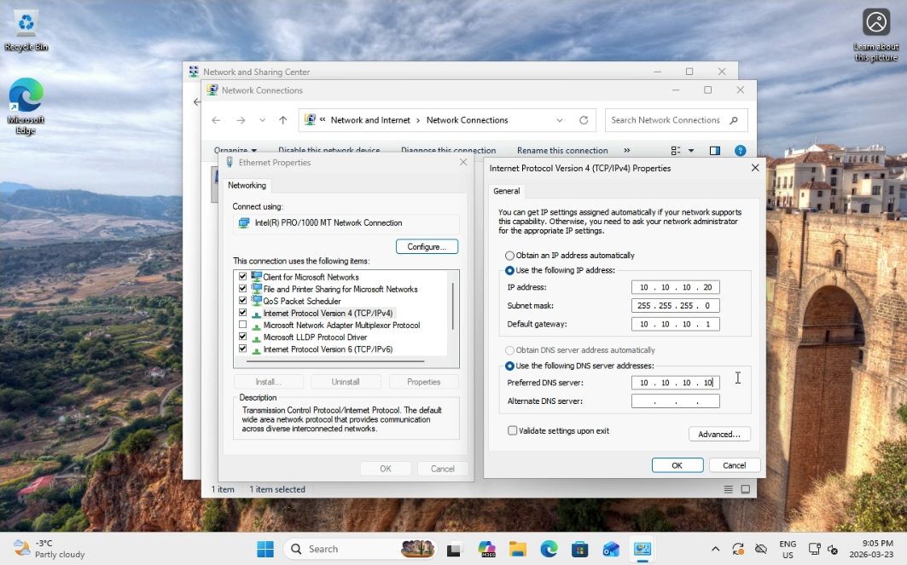
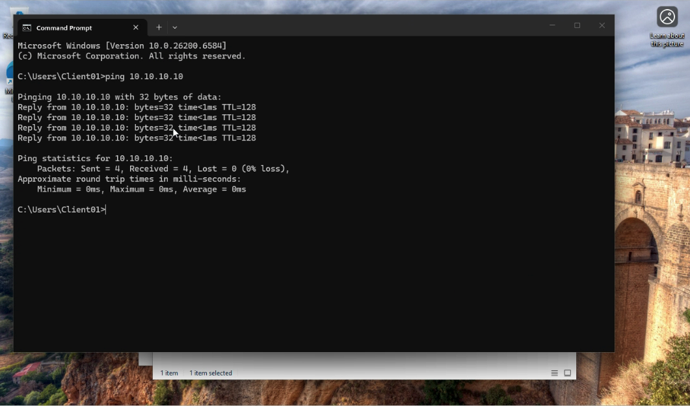
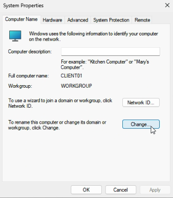
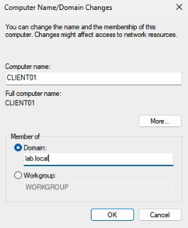
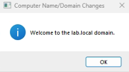
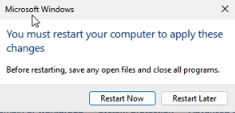
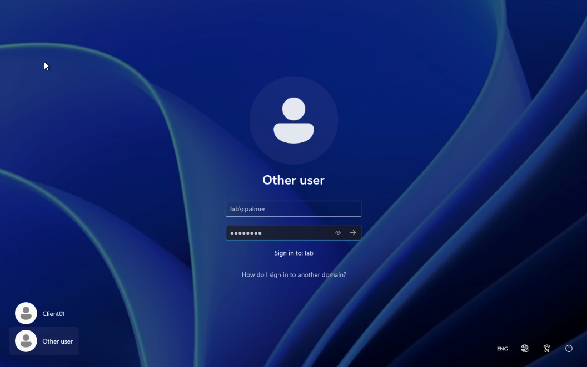
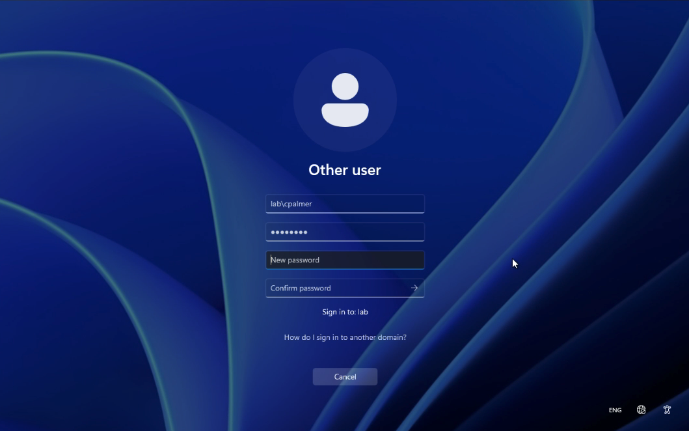
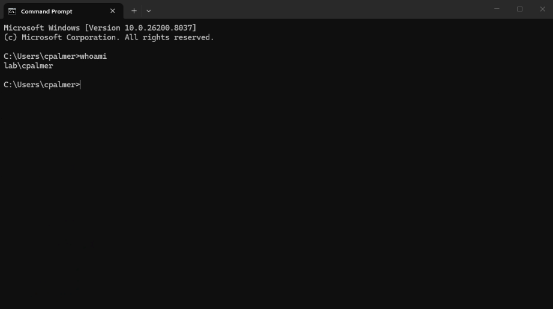

# Lab 03 - Join Client to Domain

## Table of Contents
- [Overview](#overview)
- [Scenario](#scenario)
- [Objectives](#objectives)
- [Tools and Services Used](#tools-and-services-used)
- [Administrative Workflow](#administrative-workflow)
- [Expected Outcome](#expected-outcome)
- [Common Issues and Troubleshooting](#common-issues-and-troubleshooting)
- [What I Learned](#what-i-learned)

## Overview
This lab documents the process of joining a Windows 11 client virtual machine to an Active Directory domain.

The purpose of this project is to demonstrate the administrative workflow required to prepare a domain-joined client, configure its network settings correctly, and verify successful domain access in a Windows environment.

## Scenario
A small business has already deployed its first Domain Controller and created initial users, groups, and Organizational Units in Active Directory.

As the IT administrator, I need to prepare a Windows 11 client device and join it to the domain so that it can be centrally managed through Active Directory.

## Objectives
- Rename the Windows 11 client computer
- Configure the client network settings for domain communication
- Set the client DNS server to the Domain Controller
- Join the client to the Active Directory domain
- Verify successful domain authentication

## Tools and Services Used
- Proxmox VE
- Windows 11 Pro
- Windows Server 2025
- Active Directory Domain Services (AD DS)
- DNS
- Command Prompt

## Administrative Workflow

### Step 1: Rename the Client Computer
- Open **Settings**
- Go to **System** > **About**
- Select **Rename this PC**
- Rename the computer to **CLIENT01**
- Restart the client when prompted



### Step 2: Configure the Client Network Settings
- Open **Control Panel**
- Go to **Network and Sharing Center**
- Select **Change adapter settings**
- Right-click the active Ethernet adapter and select **Properties**
- Select **Internet Protocol Version 4 (TCP/IPv4)** and click **Properties**
- Configure the client network settings:
  - IP address: **10.10.10.20** or another available IP in the lab subnet
  - Subnet mask: **255.255.255.0**
  - Default gateway: **10.10.10.1**
  - Preferred DNS server: **10.10.10.10**

The DNS server must point to the Domain Controller so the client can resolve the Active Directory domain correctly.



### Step 3: Verify Connectivity to the Domain Controller
- Open **Command Prompt**
- Run a basic connectivity test to confirm the client can reach the Domain Controller
  ``` bash
  ping 10.10.10.10
  ```
  or
  ```
  ping lab.local
  ```
- Verify that the client can communicate with:
  - **10.10.10.10**
  - **lab.local**

This step helps confirm that the network and DNS settings are correct before attempting the domain join.



### Step 4: Join the Client to the Domain
- Open **Settings**
- Go to **System** > **About**
- Select **Domain or workgroup**
- Click **Change**
- Choose **Domain**
- Enter the domain name: **lab.local**
- When prompted, enter domain administrator credentials
- Confirm the domain join request

This step joins the client computer to the Active Directory domain so it can be centrally authenticated and managed.







### Step 5: Restart the Client
- Restart the Windows 11 client after the domain join completes
- Wait for the system to boot back to the sign-in screen

A restart is required for the domain join to take full effect.



### Step 6: Sign In with a Domain User Account
- At the sign-in screen, select **Other user** if needed
- Sign in using a domain account, such as:
  - **lab\username**
  - or **username@lab.local**
- Change your password if this is the first time you signin as a Domain User
- Confirm that the domain user can log in successfully
- Run a basic command to verify the user join the domain successfully
  ``` bash
  whoami
  ```

This step verifies that the client has joined the domain correctly and that centralized authentication is working.







## Expected Outcome
At the end of this lab:
- The Windows 11 client is renamed to **CLIENT01**
- The client network settings are configured correctly for domain communication
- The client is joined to the **lab.local** domain
- The client can authenticate using a domain user account
- The client is ready for future Group Policy and shared resource testing

## Common Issues and Troubleshooting

### Issue 1: The client cannot join the domain
Possible causes:
- DNS server is not pointing to the Domain Controller
- The domain name was entered incorrectly
- The client cannot communicate with the Domain Controller

### Issue 2: Domain credentials are rejected
Possible causes:
- Incorrect username or password
- Wrong account format was used
- The account does not have permission to join the domain

### Issue 3: The client can ping the DC by IP but not by domain name
Possible causes:
- DNS server is set incorrectly
- The client is using a public DNS server instead of the Domain Controller
- DNS records are not resolving correctly

### Issue 4: The domain user cannot sign in after restart
Possible causes:
- The domain join did not complete successfully
- The wrong sign-in format was used
- The client was not restarted after joining the domain

## What I Learned
I learned that domain join depends heavily on correct DNS and network configuration, not just the domain join wizard itself.

This lab helped me understand how a Windows client communicates with a Domain Controller, how DNS supports domain authentication, and how client devices become part of a centrally managed Active Directory environment.
