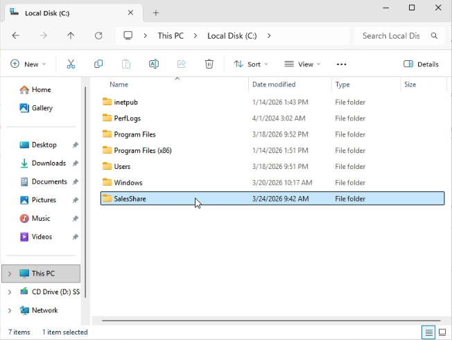

# Lab 04 - Shared Folder and NTFS Permissions

## Table of Contents
- [Overview](#overview)
- [Scenario](#scenario)
- [Objectives](#objectives)
- [Tools and Services Used](#tools-and-services-used)
- [Administrative Workflow](#administrative-workflow)
- [Expected Outcome](#expected-outcome)
- [Common Issues and Troubleshooting](#common-issues-and-troubleshooting)
- [What I Learned](#what-i-learned)

## Overview
This lab documents the process of creating a shared folder in a Windows domain environment and assigning both share permissions and NTFS permissions.

The purpose of this project is to demonstrate how access to shared resources can be controlled through Active Directory security groups in a structured and manageable way.

## Scenario
A small business needs to provide a shared folder for the Sales department so employees can access common files from a domain-joined client device.

As the IT administrator, I need to create the shared folder, assign the correct permissions, and verify that only authorized users can access it.

## Objectives
- Create a shared folder on the Windows Server
- Configure share permissions
- Configure NTFS permissions
- Assign access using Active Directory security groups
- Test folder access from a domain-joined client

## Tools and Services Used
- Proxmox VE
- Windows Server 2025
- Windows 11 Pro
- Active Directory Domain Services (AD DS)
- Active Directory Users and Computers
- File Explorer
- Server Manager

## Administrative Workflow

### Step 1: Create the Shared Folder
- Sign in to **DC01**
- Open **File Explorer**
- Create a folder such as **C:\SalesShare**

This folder will be used as the shared resource for the Sales department.

### Step 2: Configure Share Permissions
- Right-click the folder and select **Properties**
- Go to the **Sharing** tab
- Select **Advanced Sharing**
- Check **Share this folder**
- Click **Permissions**
- Remove unnecessary default entries if needed
- Add the **Sales-Users** group
- Assign the required share permissions, such as **Change** and **Read**
- Click **Apply** and **OK** to save the settings

This step controls access to the folder over the network.
