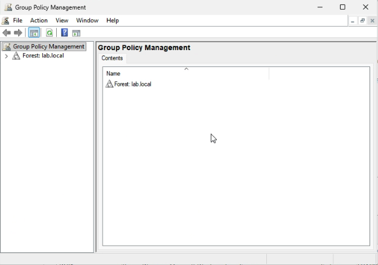
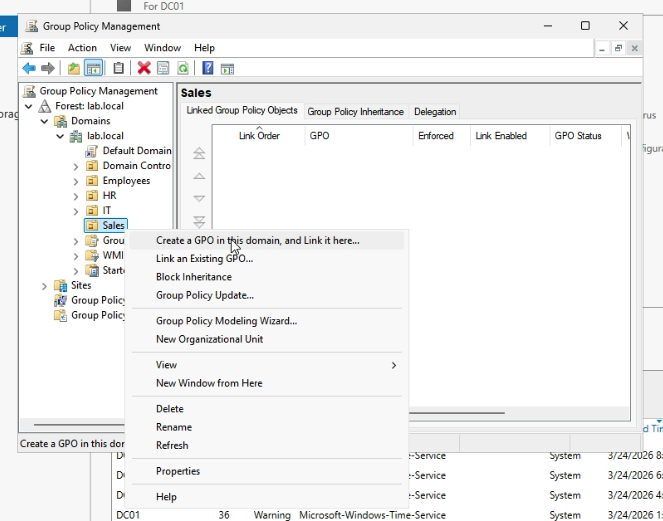
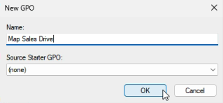
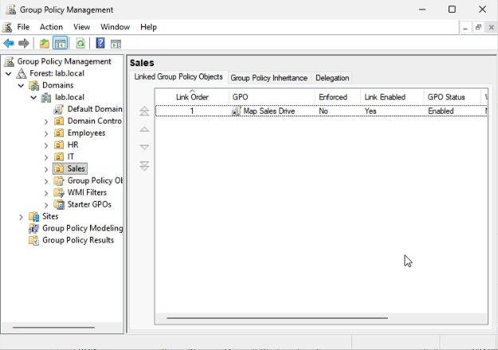
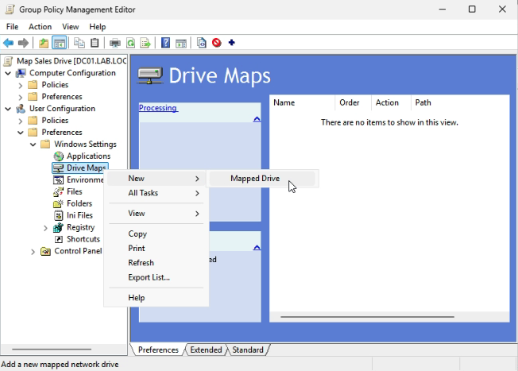
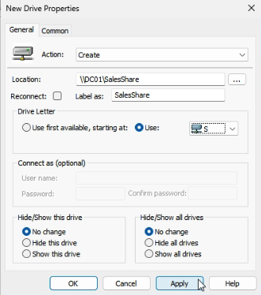

# Lab 05 - Map Shared Folder with Group Policy

## Table of Contents
- [Overview](#overview)
- [Scenario](#scenario)
- [Objectives](#objectives)
- [Tools and Services Used](#tools-and-services-used)
- [Administrative Workflow](#administrative-workflow)
- [Expected Outcome](#expected-outcome)
- [Common Issues and Troubleshooting](#common-issues-and-troubleshooting)
- [What I Learned](#what-i-learned)

## Overview
This lab documents the process of using Group Policy to map a shared folder automatically for domain users in an Active Directory environment.

The purpose of this project is to demonstrate how Group Policy can be used to standardize user access to shared network resources in a more efficient and manageable way.

## Scenario
A small business wants Sales users to access their department shared folder more easily without manually entering the network path each time.

As the IT administrator, I need to create and apply a Group Policy Object (GPO) that automatically maps the Sales shared folder for the appropriate users when they sign in to a domain-joined client.

## Objectives
- Open and manage Group Policy in a domain environment
- Create a new Group Policy Object (GPO)
- Configure a mapped network drive using Group Policy Preferences
- Link the policy to the correct Organizational Unit (OU)
- Verify that the mapped drive appears for the intended domain user

## Tools and Services Used
- Windows Server 2025
- Windows 11 Pro
- Active Directory Domain Services (AD DS)
- Group Policy Management
- File Explorer
- Proxmox VE

## Administrative Workflow

### Step 1: Open Group Policy Management
- Sign in to **DC01**
- Open **Server Manager**
- Select **Tools**
- Click **Group Policy Management**

This tool is used to create, edit, and link Group Policy Objects in the Active Directory environment.



### Step 2: Create and Link a New Group Policy Object
- In **Group Policy Management**, locate the **Sales** OU
- Right-click the OU and select **Create a GPO in this domain, and Link it here**
- Name the policy **Map Sales Drive**
- Confirm that the GPO is linked and enabled for the Sales OU

This step creates the Group Policy Object and links it to the correct OU so that it applies to the intended users.







### Step 3: Edit the GPO to Map the Shared Folder
- Right-click the new GPO and select **Edit**
- Go to:
  - **User Configuration**
  - **Preferences**
  - **Windows Settings**
  - **Drive Maps**
- Right-click **Drive Maps**
- Select **New** > **Mapped Drive**
- Configure the drive mapping:
  - **Action:** Create
  - **Location:** `\\DC01\SalesShare`
  - **Label as:** `SalesShare`
  - **Drive Letter:** `S:` (or another available letter)
- Click **Apply** and **OK** to save the settings

This step configures the GPO to automatically map the shared folder as a network drive for targeted users.





### Step 4: Update Group Policy on the Domain Client
- Sign in to **CLIENT01** using the intended domain user
- Open **Command Prompt**
- Run the following command:

```bash
gpupdate /force
```
- Wait for Group Policy to refresh

This step forces the client to pull the latest policy settings without waiting for the normal refresh interval.
