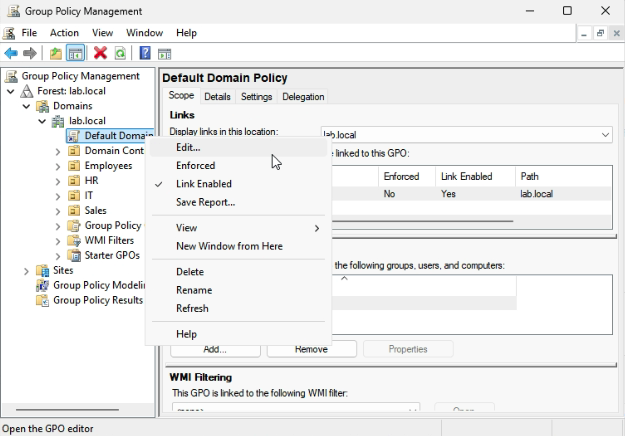

# Lab 06 - Password and Account Lockout Policy

## Table of Contents
- [Overview](#overview)
- [Scenario](#scenario)
- [Objectives](#objectives)
- [Tools and Services Used](#tools-and-services-used)
- [Administrative Workflow](#administrative-workflow)
- [Expected Outcome](#expected-outcome)
- [Common Issues and Troubleshooting](#common-issues-and-troubleshooting)
- [What I Learned](#what-i-learned)

## Overview
This lab documents the process of configuring password and account lockout policies in an Active Directory domain environment.

The purpose of this project is to demonstrate how domain-level security settings can be used to strengthen account protection and reduce the risk of unauthorized access.

## Scenario
A small business wants to improve account security in its Windows domain environment by enforcing stronger password requirements and locking accounts after repeated failed sign-in attempts.

As the IT administrator, I need to configure a password policy and account lockout policy for the domain and verify that the settings apply correctly.

## Objectives
- Review the existing Default Domain Policy
- Configure a password policy for the domain
- Configure an account lockout policy
- Apply the updated policy settings
- Verify that the policy affects domain user accounts

## Tools and Services Used
- Windows Server 2025
- Windows 11 Pro
- Active Directory Domain Services (AD DS)
- Group Policy Management
- Command Prompt
- Server Manager
- Proxmox VE

## Administrative Workflow

### Step 1: Open Group Policy Management
- Sign in to **DC01**
- Open **Server Manager**
- Select **Tools**
- Click **Group Policy Management**

### Step 2: Edit the Default Domain Policy
- In **Group Policy Management**, expand the domain
- Locate **Default Domain Policy**
- Right-click the policy and select **Edit**

The Default Domain Policy is commonly used to configure domain-wide password and account lockout settings.

### Step 3: Configure Password Policy Settings
- In the Group Policy Management Editor, go to:
  - **Computer Configuration**
  - **Policies**
  - **Windows Settings**
  - **Security Settings**
  - **Account Policies**
  - **Password Policy**
- Configure settings such as:
  - **Minimum password length:** `8`
  - **Password must meet complexity requirements:** `Enabled`
 
  This step helps enforce stronger password standards for domain user accounts.
