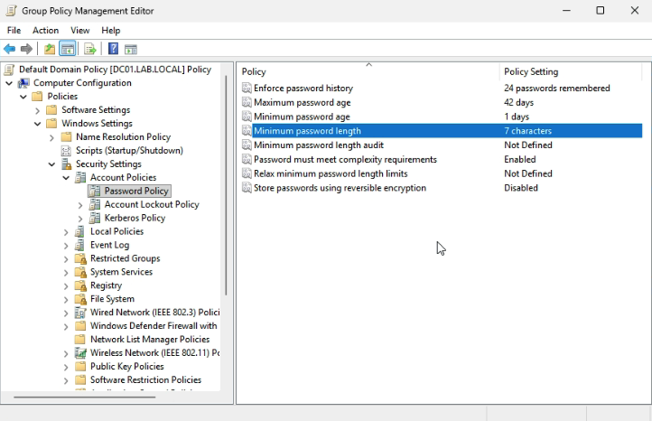
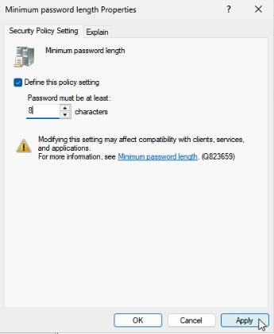
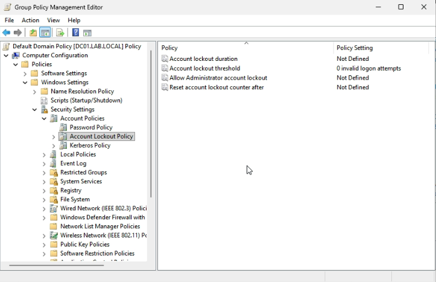
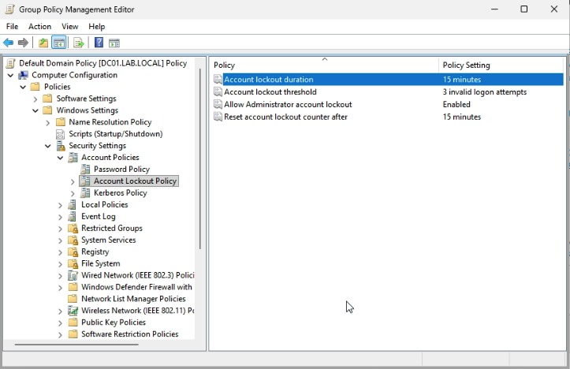
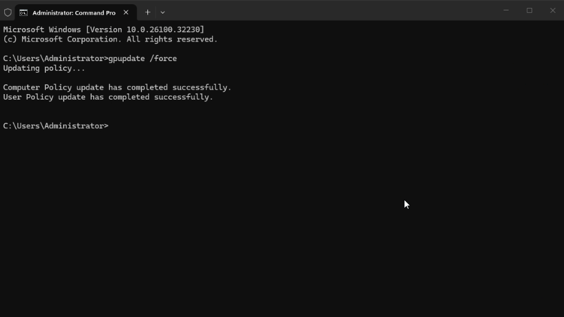
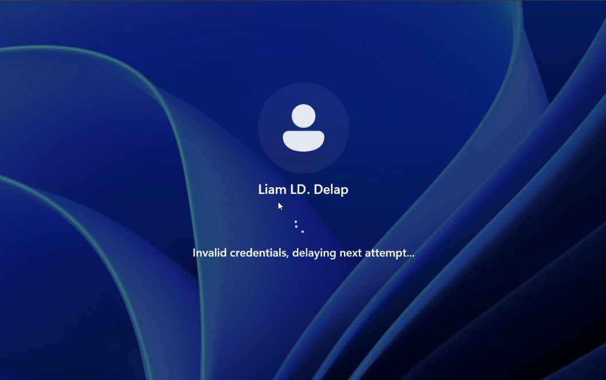
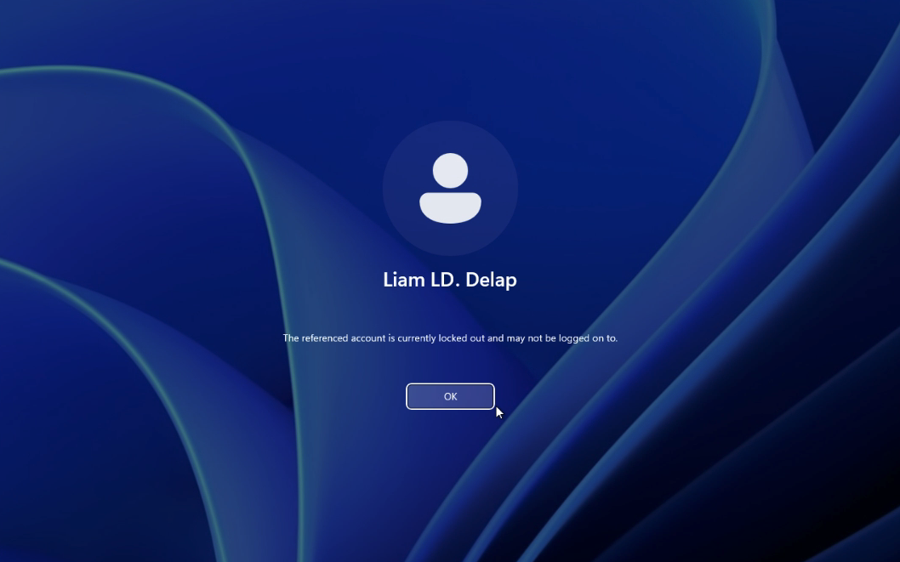
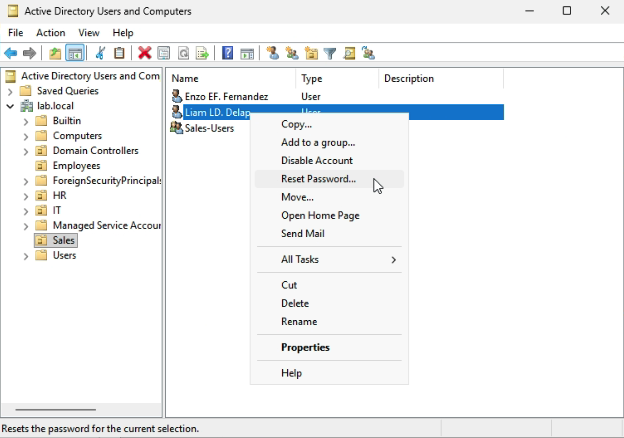
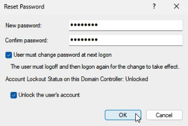

# Lab 06 - Password and Account Lockout Policy

## Table of Contents
- [Overview](#overview)
- [Scenario](#scenario)
- [Objectives](#objectives)
- [Tools and Services Used](#tools-and-services-used)
- [Administrative Workflow](#administrative-workflow)
- [Expected Outcome](#expected-outcome)
- [Common Issues and Troubleshooting](#common-issues-and-troubleshooting)
- [What I Learned](#what-i-learned)

## Overview
This lab documents the process of configuring password and account lockout policies in an Active Directory domain environment.

The purpose of this project is to demonstrate how domain-level security settings can be used to strengthen account protection and reduce the risk of unauthorized access.

## Scenario
A small business wants to improve account security in its Windows domain environment by enforcing stronger password requirements and locking accounts after repeated failed sign-in attempts.

As the IT administrator, I need to configure a password policy and account lockout policy for the domain and verify that the settings apply correctly.

## Objectives
- Review the existing Default Domain Policy
- Configure a password policy for the domain
- Configure an account lockout policy
- Apply the updated policy settings
- Verify that the policy affects domain user accounts

## Tools and Services Used
- Windows Server 2025
- Windows 11 Pro
- Active Directory Domain Services (AD DS)
- Group Policy Management
- Command Prompt
- Server Manager
- Proxmox VE

## Administrative Workflow

### Step 1: Open Group Policy Management
- Sign in to **DC01**
- Open **Server Manager**
- Select **Tools**
- Click **Group Policy Management**

### Step 2: Edit the Default Domain Policy
- In **Group Policy Management**, expand the domain
- Locate **Default Domain Policy**
- Right-click the policy and select **Edit**

The Default Domain Policy is commonly used to configure domain-wide password and account lockout settings.


### Step 3: Configure Password Policy Settings
- In the Group Policy Management Editor, go to:
  - **Computer Configuration**
  - **Policies**
  - **Windows Settings**
  - **Security Settings**
  - **Account Policies**
  - **Password Policy**
- Configure settings such as:
  - **Minimum password length:** `8`
  - **Password must meet complexity requirements:** `Enabled`
 
  This step helps enforce stronger password standards for domain user accounts.





### Step 4: Configure Account Lockout Policy Settings
- In the same **Account Policies** section, open **Account Lockout Policy**
- Configure:
  - **Account lockout duration:** `15 minutes`
  - **Account lockout threshold:** `3 invalid logon attempts`
  - **Allow Administrator account lockout:** `Enabled`
  - **Reset account lockout counter after:** `15 minutes`
  
This step helps protect accounts against repeated failed sign-in attempts.





### Step 5: Update Group Policy
- Open **Command Prompt** on **DC01**
- Run the following command:

```bash
gpupdate /force
```

- Allow the policy update to complete

This step forces the updated domain policy settings to refresh without waiting for the normal background update interval.



### Step 6: Verify the Policy from a Domain User Perspective
- Sign in to CLIENT01
- Use a domain user account
- Attempt incorrect sign-ins to test account lockout behavior
- Confirm that the account becomes locked after the configured number of failed attempts

This step helps verify that the account lockout policy is working as intended from the client side.

> Note: If the account is locked, the user has two options. The first option is to wait for the configured lockout duration to expire and then try signing in again with the correct password. The second option is to contact an administrator, who can manually unlock the account in Active Directory Users and Computers.





### Step 7: Reset the User Password and Unlock the Account
- Sign in to **DC01**
- Open **Server Manager**
- Select **Tools**
- Click **Active Directory Users and Computers**
- Locate the locked test user account
- Right-click the user and select **Reset Password**
- Enter a new password and confirm it
- Check **User must change password at next logon**
- Check **Unlock the user's account**
- Apply the changes and test sign-in again on the client

This step demonstrates how an administrator can recover a locked user account and restore access after repeated failed sign-in attempts.





## Expected Outcome
At the end of this lab:
- A password policy is configured for the domain
- An account lockout policy is configured for the domain
- The Default Domain Policy is updated successfully
- Domain user accounts are affected by the new policy settings
- A test user account can be locked after repeated failed sign-in attempts
- A locked account can be recovered through administrative action
- The environment demonstrates a practical use of domain-level security policy configuration
