# Lab 07 - Delegated Admin Access

## Table of Contents
- [Overview](#overview)
- [Scenario](#scenario)
- [Objectives](#objectives)
- [Tools and Services Used](#tools-and-services-used)
- [Administrative Workflow](#administrative-workflow)
- [Expected Outcome](#expected-outcome)
- [Common Issues and Troubleshooting](#common-issues-and-troubleshooting)
- [What I Learned](#what-i-learned)

## Overview
This lab documents the process of configuring delegated admin access in an Active Directory domain environment.

The purpose of this project is to demonstrate how limited administrative permissions can be assigned to a support account without granting full Domain Admin rights.

## Scenario
A small business wants junior IT staff to perform basic user support tasks for employees in different departments without giving them full Domain Admin rights.

As the IT administrator, I need to create a dedicated support account in the IT OU, assign it to a delegated security group, and grant limited permissions over the HR and Sales OUs.

## Objectives
- Create a dedicated IT support account
- Create a security group for delegated administration
- Add the support account to the delegated group
- Delegate limited permissions to the target OUs
- Verify that the support account can perform the assigned tasks
- Confirm that the support account does not have full Domain Admin rights

## Tools and Services Used
- Windows Server 2025
- Active Directory Users and Computers
- Active Directory Domain Services (AD DS)
- Server Manager
- Proxmox VE

## Administrative Workflow

### Step 1: Open Active Directory Users and Computers
- Sign in to **DC01**
- Open **Server Manager**
- Select **Tools**
- Click **Active Directory Users and Computers**

### Step 2: Create a Security Group for Delegated Access
- In **Active Directory Users and Computers**, locate the appropriate OU for administrative groups
- Right-click the OU and select **New > Group**
- Create a group named:
  - **Delegated Admins**
- Set:
  - **Group scope:** `Global`
  - **Group type:** `Security`
- Click **OK**

This group will be used to assign limited administrative permissions in a more organized way.

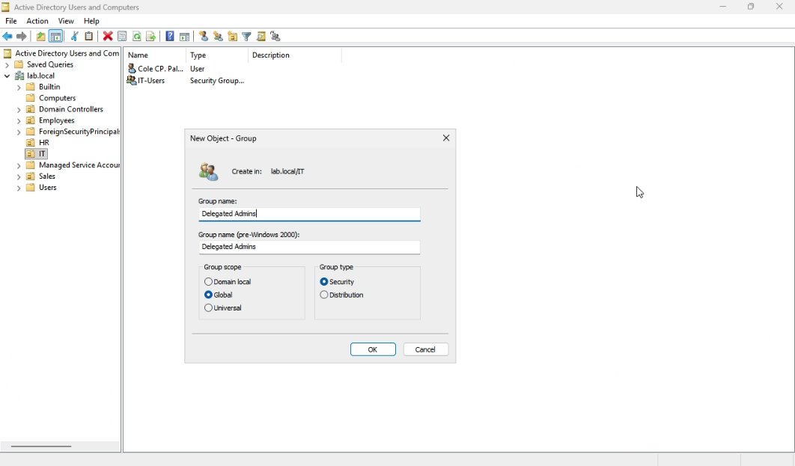

### Step 3: Create a Dedicated IT Support User in the IT OU
- In the **IT** OU, right-click and select **New > User**
- Create a support account
- Example:
  - **First name:** `IT`
  - **Last name:** `Support`
  - **User logon name:** `itsupport`
- Set a password for the account
- Configure the password options as needed
- Complete the user creation process

This creates a dedicated support account instead of using a highly privileged account for daily support tasks.

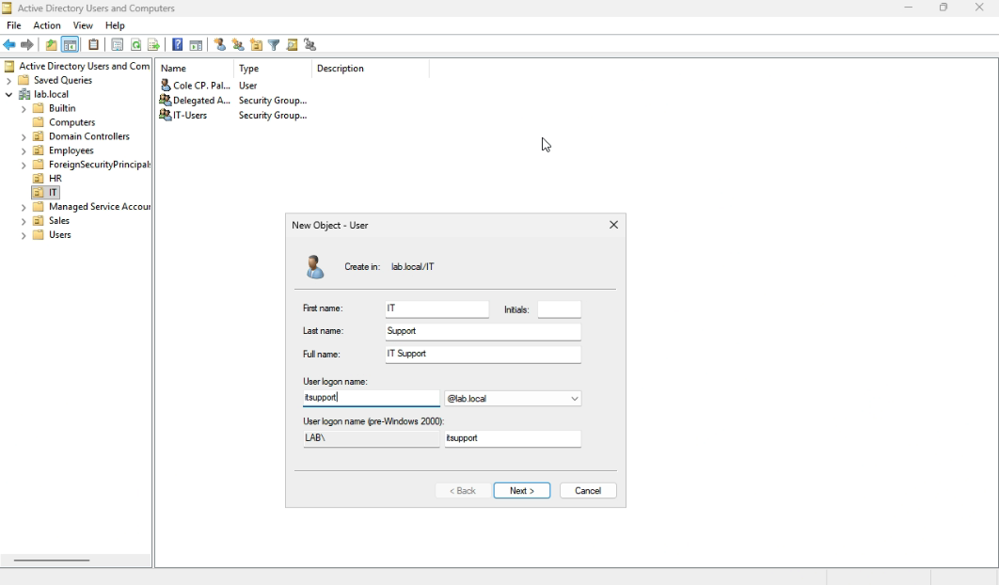

### Step 4: Add the Support User to the Delegated Group
- Locate the **itsupport** account
- Open **Properties**
- Go to the **Member Of** tab
- Click **Add**
- Add the account to:
  - **Delegated Admins**
- Click **Apply** and **OK**

This step adds the support account to the security group that will receive delegated permissions.

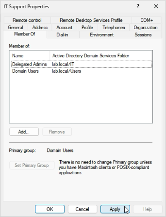

### Step 5: Delegate Control on the HR OU
- In Active Directory Users and Computers, right-click the **HR** OU
- Select **Delegate Control**
- Click **Next**
- Click **Add**
- Select:
  - **Delegated Admins**
- Click **OK**
- Click **Next**
- Select the following common tasks:
  - **Reset user passwords and force password change at next logon**
  - **Read all user information**
  - **Create, delete, and manage user accounts**
- Complete the wizard

This step grants the delegated group limited user administration permissions over the HR OU without assigning full domain-wide administrative rights.

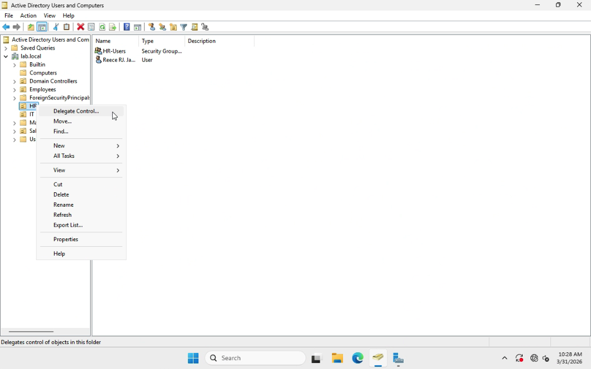

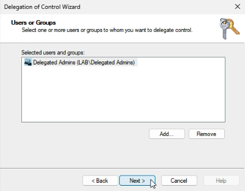

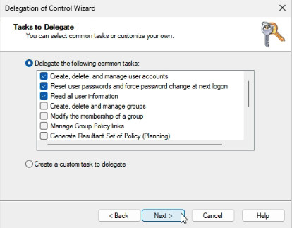

### Step 6: Delegate Control on the Sales OU
- In Active Directory Users and Computers, right-click the **Sales** OU
- Select **Delegate Control**
- Click **Next**
- Click **Add**
- Select:
  - **Delegated Admins**
- Click **OK**
- Click **Next**
- Select the following common tasks:
  - **Reset user passwords and force password change at next logon**
  - **Read all user information**
  - **Create, delete, and manage user accounts**
- Complete the wizard

This step grants the delegated group limited user administration permissions over the Sales OU without assigning full domain-wide administrative rights.

### Step 7: Prepare ADMIN01 with RSAT
- Create a new Windows 11 Pro virtual machine named **ADMIN01**
- Join **ADMIN01** to the **lab.local** domain
- Sign in to **ADMIN01** using an administrative account
- Open **Settings > System > Optional features**
- Click **View features**
- Click **Available features**
- Search for:
  - **RSAT: Active Directory Domain Services and Lightweight Directory Services Tools**
- Select the feature and install it

This step prepares ADMIN01 as a dedicated admin workstation for Active Directory management tasks.

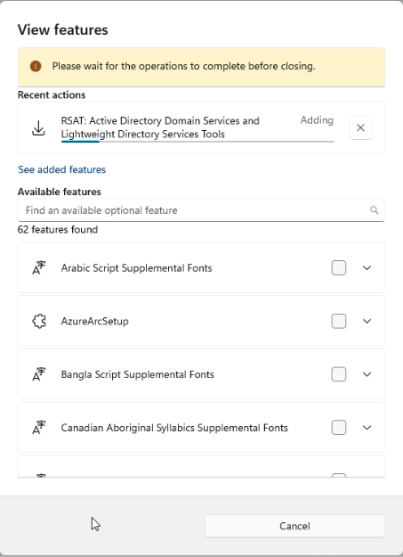

### Step 8: Sign In with the IT Support Account
- Sign out of the administrative account on **ADMIN01**
- Sign in using the **IT Support** account
- Open **Active Directory Users and Computers** from **Windows Tools** or by searching from the Start menu

This step is used to verify that the delegated support account can access the AD management tools from ADMIN01.

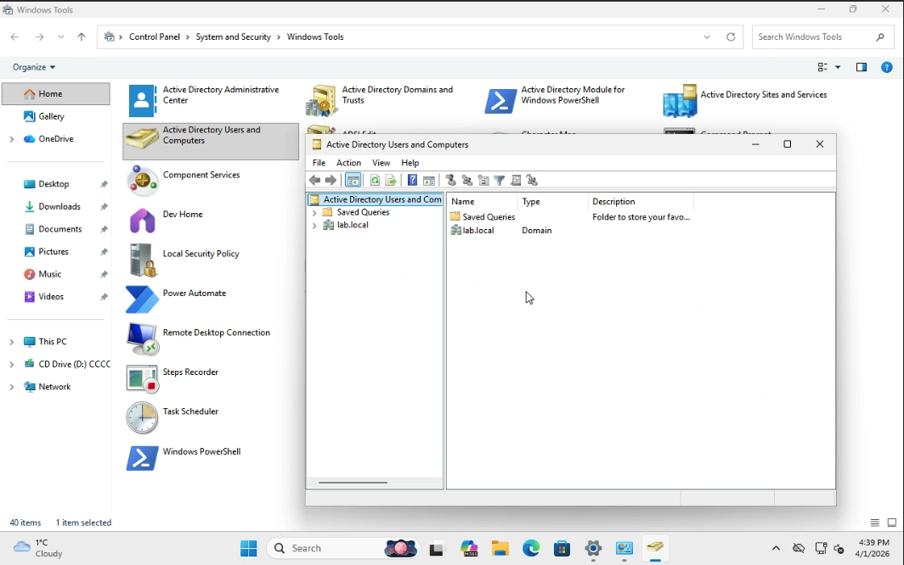

### Step 9: Test the Delegated Permissions
- In **Active Directory Users and Computers**, browse to the **HR** OU
- Right-click inside the OU and select **New > User**
- Create a new test user account
- Complete the user creation process
- Next, browse to the **Sales** OU
- Select a test user account
- Right-click the user and choose **Reset Password**
- Enter a new password

This step confirms that the IT Support account can create a new user account and reset a user password in the delegated OUs.

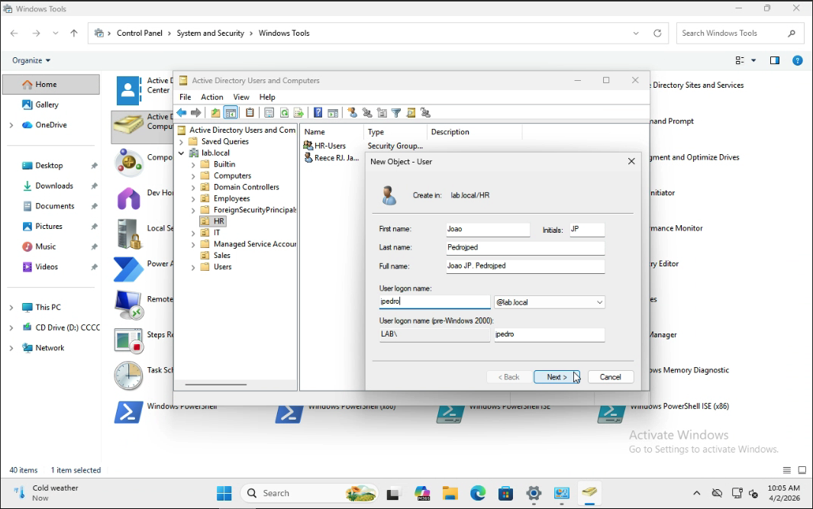

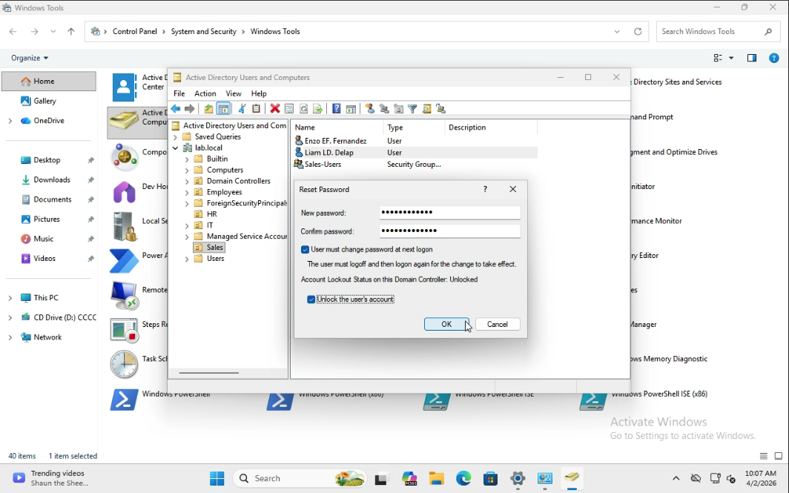

### Step 10: Confirm the Account Does Not Have Full Administrative Rights
- Open the IT Support account properties
- Review the Member Of tab
- Confirm the account is not a member of:
  - Domain Admins
  - Enterprise Admins
- Confirm the account only has the delegated permissions assigned through the target OUs

This step verifies that the support account can perform limited administrative tasks without having full domain-wide control.

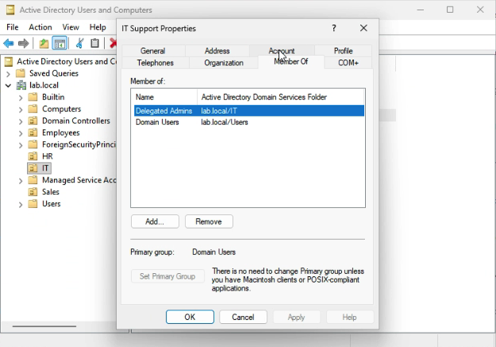

## Expected Outcome
At the end of this lab:
- A dedicated IT Support account is created
- A delegated security group is created and configured
- The IT Support account is added to the delegated group
- Limited administrative permissions are assigned to the HR and Sales OUs
- The IT Support account can create a new user and reset a user passwprd in the HR OU
- The IT Support account can create a new user and reset a user password in the Sales OU
- The IT Support account does not have full Domain Admin rights

This lab demonstrates how delegated administration can be used to assign limited support responsibilities in an Active Directory environment.

## Common Issues and Troubleshooting

### Issue 1: The IT Support account cannot create a new user or reset a user password
**Possible causes:**
- The delegated permissions were not assigned correctly
- The wrong OU was selected during delegation
- The IT Support account was not added to the delegated group

**Troubleshooting steps:**
- Verify that the delegation was applied to the correct OU
- Confirm that the IT Support account is a member of the delegated security group
- Sign out and sign back in to refresh group membership
- Review the delegation settings in Active Directory Users and Computers

### Issue 2: Active Directory Users and Computers is not available on ADMIN01
**Possible causes:**
- RSAT was not installed
- The wrong RSAT feature was selected
- The installation did not complete successfully

**Troubleshooting steps:**
- Open **Settings > System > Optional features**
- Confirm that **RSAT: Active Directory Domain Services and Lightweight Directory Services Tools** is installed
- Retry the installation using an administrative account if needed
- Search for **Active Directory Users and Computers** from the Start menu or open it from **Windows Tools**
