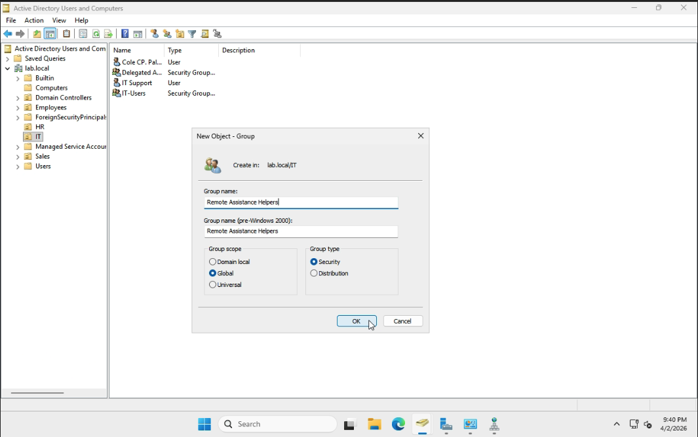
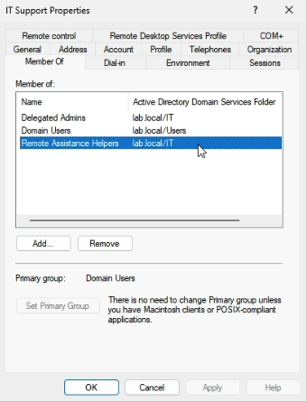
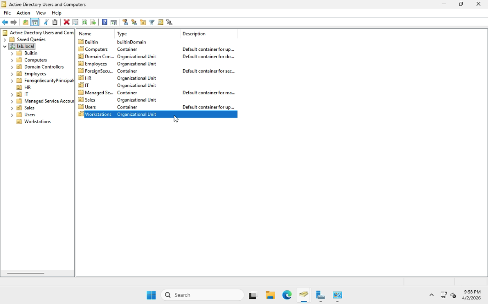
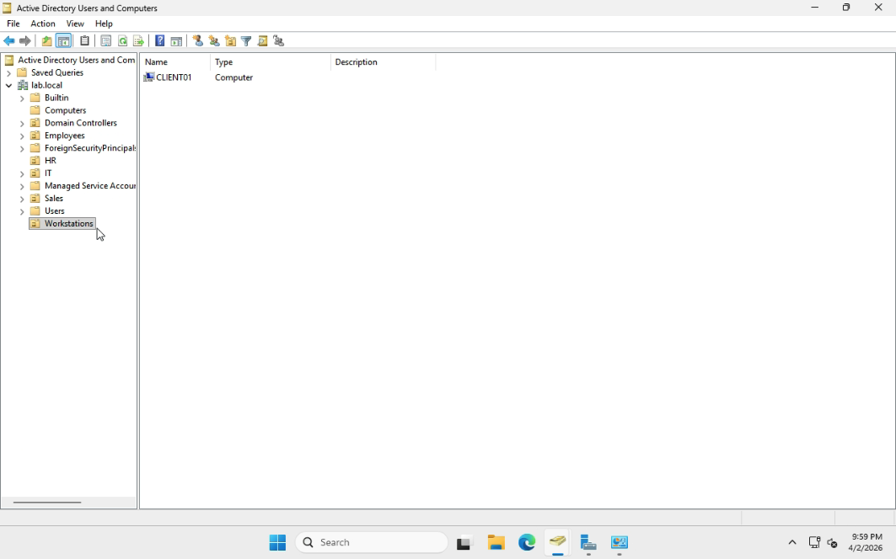
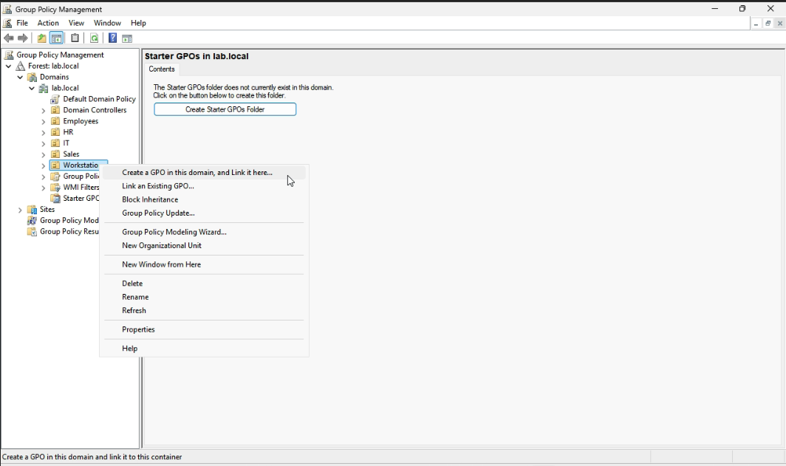
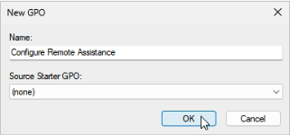
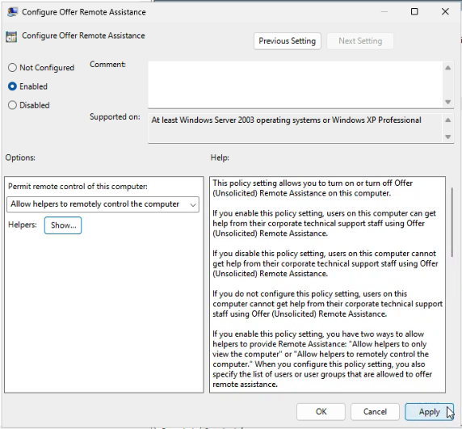
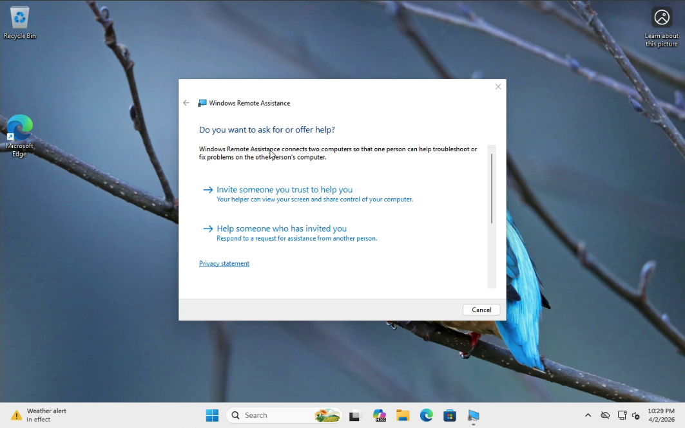

# Lab 08 - Configure Remote Assistance by Group Policy

## Table of Contents
- [Overview](#overview)
- [Scenario](#scenario)
- [Objectives](#objectives)
- [Tools and Services Used](#tools-and-services-used)
- [Administrative Workflow](#administrative-workflow)
- [Expected Outcome](#expected-outcome)
- [Common Issues and Troubleshooting](#common-issues-and-troubleshooting)
- [What I Learned](#what-i-learned)

## Overview
This lab documents the process of configuring Remote Assistance by Group Policy in an Active Directory domain environment.

The purpose of this project is to demonstrate how remote support access can be centrally configured for a delegated IT support account.

## Scenario
A company wants to allow the IT Support account to remotely assist users on domain-joined client computers.

As the IT administrator, I need to use Group Policy to enable Offer Remote Assistance on the target client computer, assign the IT Support account as an allowed helper, and verify that remote assistance can be offered from ADMIN01 to CLIENT01.

## Objectives
- Create a dedicated security group for Remote Assistance helpers
- Add the IT Support account to the helper group
- Create and link a GPO for Remote Assistance
- Enable Offer Remote Assistance through Group Policy
- Configure the helper group in the policy
- Verify that the required firewall settings are allowed
- Test a Remote Assistance connection from ADMIN01 to CLIENT01

## Tools and Services Used
- Windows Server 2025
- Windows 11 Pro
- Active Directory Users and Computers
- Group Policy Management
- Windows Remote Assistance
- Windows Defender Firewall
- Proxmox VE

## Administrative Workflow

### Step 1: Create a Security Group for Remote Assistance Helpers
- Sign in to **DC01**
- Open **Active Directory Users and Computers**
- Open the **IT** OU
- Right-click the OU and select **New > Group**
- Create a group named:
  - **Remote Assistance Helpers**
- Set:
  - **Group scope:** `Global`
  - **Group type:** `Security`
- Click **OK**

### Step 2: Add the IT Support Account to the Helper Group
- Locate the **itsupport** account
- Open **Properties**
- Go to the **Member Of** tab
- Click **Add**
- Add:
  - **Remote Assistance Helpers**
- Click **Apply** and **OK**

This step places the IT Support account into the group that will be granted Remote Assistance permissions through Group Policy.

### Step 3: Create a Workstations OU and Move CLIENT01
- Open **Active Directory Users and Computers**
- Right-click **lab.local** and select **New > Organizational Unit**
- Create a new OU named:
  - **Workstations**
- Open the default **Computers** container
- Locate **CLIENT01**
- Right-click **CLIENT01** and select **Move**
- Move the computer account to the **Workstations** OU

This step places the client computer into an OU so that a computer-based Group Policy can be linked and applied more easily.

### Step 4: Create and Link a Group Policy Object
- Open **Group Policy Management**
- Right-click the **Workstations** OU
- Select **Create a GPO in this domain, and Link it here**
- Name the GPO:
  - **Configure Remote Assistance**
- Click **OK**

This step creates a computer-based Group Policy Object and links it to the OU that contains CLIENT01.

### Step 5: Configure Offer Remote Assistance
- Right-click the **Configure Remote Assistance** GPO
- Select **Edit**
- Go to:
  - **Computer Configuration > Policies > Administrative Templates > System > Remote Assistance**
- Open:
  - **Configure Offer Remote Assistance**
- Set the policy to **Enabled**
- Choose:
  - **Allow helpers to remotely control the computer**
- Add the allowed helper:
  - **lab\Remote Assistance Helpers**
- Click **Apply** and **OK**

This step enables Offer Remote Assistance and assigns the helper group that is allowed to provide remote support.

### Step 6: Sign In to ADMIN01 with the IT Support Account
- After the Group Policy has been applied to **CLIENT01**, sign in to **ADMIN01** using the **itsupport** account
- Open **Windows Remote Assistance**

This step prepares the support workstation for the Remote Assistance test.

### Step 7: Offer Remote Assistance to CLIENT01
- In **Windows Remote Assistance**, select:
  - **Help someone who has invited you**
- Click:
  - **Advanced connection option for help desk**
- In the computer name field, enter:
  - **CLIENT01**
- Click **Next**
